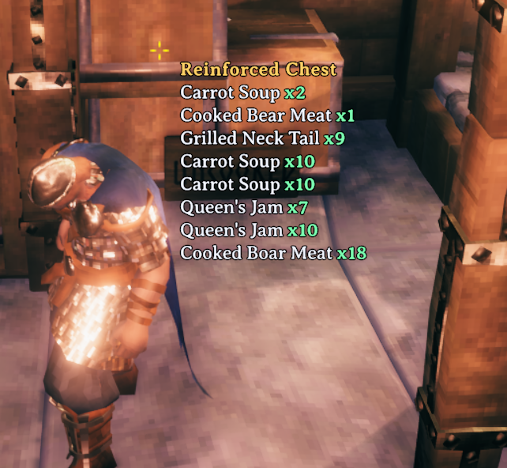

# Catos Chest Viewer

By **Catosaur**.

Client-side mod to see what is inside a chest while looking at it, without opening the container.

## Client-side only

CatosChestViewer is a **client-side mod**. It does **not** need to be
installed on a dedicated server, and other players do not need to install it.
Each client independently renders its own local hover display.

## Installation

Install the Thunderstore package with a Valheim mod manager, or place
`CatosChestViewer.dll` in the client profile's `BepInEx/plugins` directory.
BepInExPack Valheim `5.4.2350` is required.

The mod creates its configuration at
`BepInEx/config/com.catosaur.catoschestviewer.cfg`.

## Compatibility

Validated against Valheim `1.0.7` / network version `39`. The mod is guarded
to load only in the Valheim client process and does not load in
`valheim_server.exe`.
